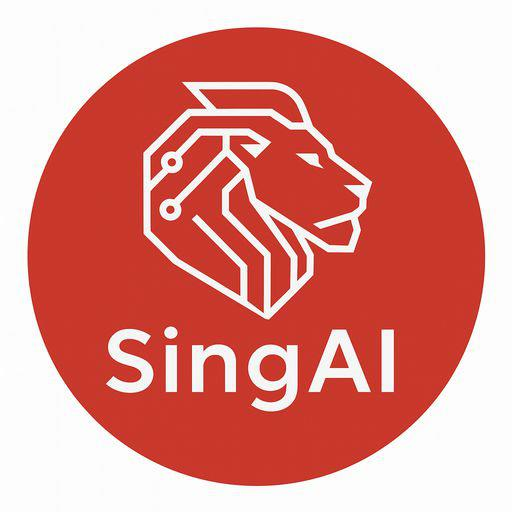

# SingAI - Unifying Government Intelligence

## Powered by AI

A highly intelligent and helpful AI chatbot designed to provide accurate and comprehensive information on Singaporean government policies, including CPF, HDB, and other public policies. SingAI leverages Retrieval Augmented Generation (RAG) to deliver precise and context-aware responses from a specialized knowledge base.

---

##  Features

* **Intelligent Q&A:** Get precise answers to your queries on CPF, HDB, and various public policies.
* **Context-Aware Conversations:** Handles follow-up questions seamlessly by retaining conversational context and synthesizing information across turns.
* **Dynamic Calculations:** Provides realistic estimations and performs clear, step-by-step calculations based on user inputs, with an option to refine them with more specific data.
* **Intuitive User Interface:** A clean, minimalist interface with a white background and subtle red accents, built using Streamlit.
* **Retrieval Augmented Generation (RAG):** Enhances response accuracy and relevance by fetching information from a Pinecone vector database.

---

##  Technologies Used

* **Python:** The core programming language.
* **Streamlit:** For building the interactive and user-friendly web interface.
* **OpenAI API:** Powers the large language model (`gpt-4o-mini`) for natural language understanding and generation.
* **LangChain:** Facilitates LLM orchestration, embedding generation, and integration with the Pinecone vector store.
* **Pinecone:** Serves as the vector database for storing and retrieving policy-related documents, enabling RAG capabilities.
* **python-dotenv:** For securely managing API keys and environment variables.

---

